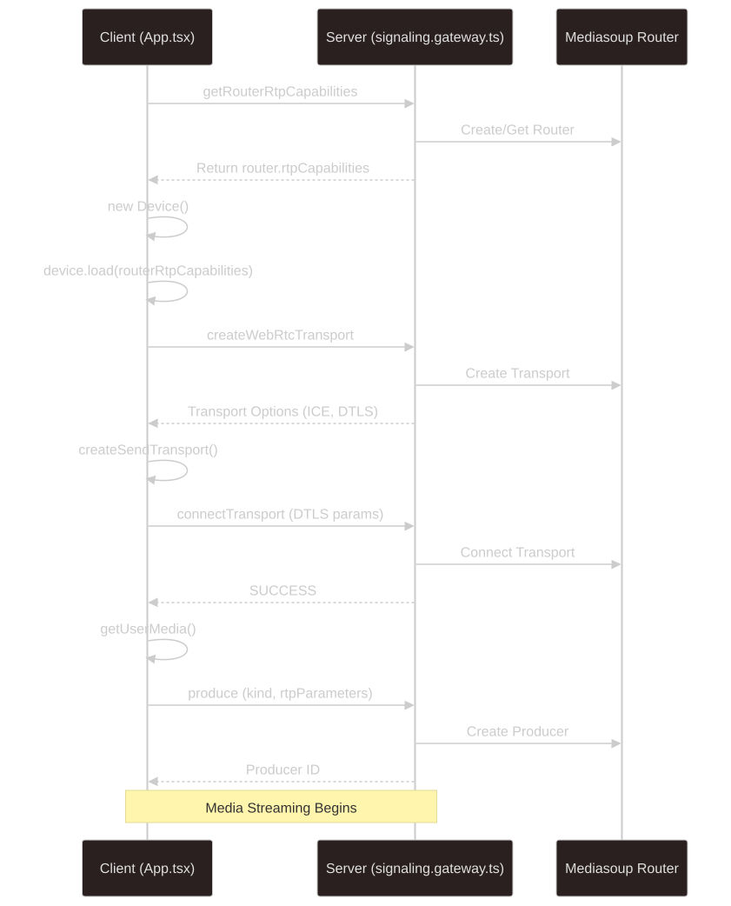

# Media Streaming with MediaSoup and NestJS

A WebRTC-based media streaming application built with MediaSoup, NestJS, and React that enables real-time video/audio communication.

## Features

- Real-time video and audio streaming
- Multi-participant support through channels
- WebRTC-based peer-to-peer communication
- Server-side media routing with MediaSoup
- React-based user interface

## Architecture

The project consists of two main components:

1. **Server (NestJS)**
   - Handles WebSocket signaling
   - Manages MediaSoup routers and transports
   - Coordinates media producers and consumers

2. **Client (React)**
   - Manages media device access
   - Handles WebRTC transport creation
   - Produces and consumes media streams

## Media Production Flow


## Media Consumption Flow


## Getting Started

### Prerequisites
- Node.js
- npm or yarn
- MediaSoup compatible environment

### Installation

1. Clone the repository:
```bash
git clone https://github.com/MrMiM-tfe/mediasoup-nest
```
2. Install server dependencies:
```bash
cd server
npm install
```

3. Install client dependencies:
```bash
cd client
npm install
```

### Running the Application
1. Start the server:
```bash
cd server
npm run start:dev
```

2. Start the client:
```bash
cd client
npm run dev
```

### Usage

1. Open the application in your browser
2. Click "cam" to start broadcasting your video/audio
3. Click "consume" to receive other participants' streams
4. Use "reset" to clear all connections

## Technical Details
### Server Components
- WebSocket Gateway for signaling
- MediaSoup Router management
- Transport handling
- Producer/Consumer coordination

### Client Components

- MediaSoup Device initialization
- WebRTC Transport management
- Media stream handling
- Dynamic video/audio rendering
